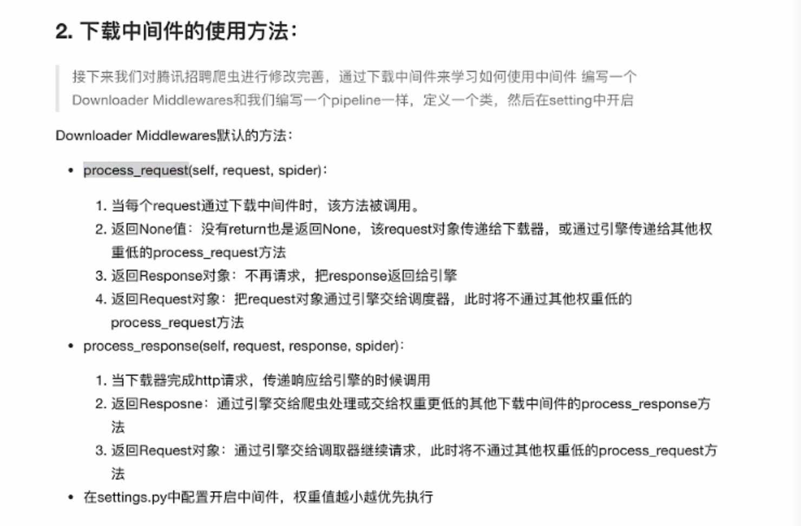

命令介绍
----
- 创建项目
scrapy startproject 项目名称

- 创建爬虫

scrapy genspider 爬虫名称 允许爬虫的域名

scrapy genspider -t crawl 爬虫名称 允许爬虫的域名

- 运行爬虫：

scrapy crawl 爬虫名称
scrapy crawl 爬虫名称 --nolog

----
Request 参数
scrapy.Request(url, callback, method='GET', headers, body, dont_filter=False, meta, cookies)
- 常用参数 url，callback，meta, dont_filter,
- 除了 url 都是可选参数
- url: 请求的url
- callback: 回调函数，不写默认 parse 解析
- meta: 实现数据在不同解析函数中的传递数据，常用在一条数据分散在多个不同结构的页面中的情况。比如第一页中的数据传递到第二个，并在第二页进行合并 itme
- dont_filter=False，是否进行过滤，False 表示进行过滤
- method: 请求方式
- headers: 请求头，接收一个字典，不包含 cookies
- cookies: 请求的cookies，接收一个字典，专门放 cookies
- body: 请求体，接收一个 json

----
pipline.py 注意事项
1. 要在 setting 文件中开启
2. 要在 setting 中设置权重，权重越小，有限度越高，会优先执行
3. 多个 pipline 的时候， process_item 必须 return item，否则后一个 pipline 获取数据为 None
4. 必须有 process_item 方法，否则无法处理数据
5. process_item 可以使用 spider 区分不同的爬虫
6. open_spider 和 close_spider 方法，在爬虫开始和结束的时候执行一次，常用于数据库连接

----
crawl spider 爬虫
- 自动根据规则提取链接并发送给引擎
- crawl spider 经常应用于数据在一个页面上采集的情况，如果数据需要在多个数据上采集，通常需要用到 spider
- 在 crawl spider 中不能重写 parse 方法

----
中间件
1. 分为爬虫中间件和下载中间件
2. 作用：修改 header 以及 cookies，设置代理 IP， 对请求进行定制化操作
3. 写在 middlewares 文件中
4. 通常使用下载中间件

- 使用方法
1. middlewares 文件中定义中间件
2. 重写处理请求或者响应的方法
3. 在 setting 文件中开启 中间件

- 下载中间件默认方法

process_reqeust(self,request,spider)
- 如果所有中间件都返回 None，则请求最终交给下载器处理
- 如果返回 request，则将请求交给调度器
- 如果返回 response，将相应对象交给 spider 进行解析
process_response(self,request,response,spider)
- 如果返回 request，则将请求交给调度器
- 如果返回 response，将相应对象交给 spider 进行解析

----
涉及到多级跳转

